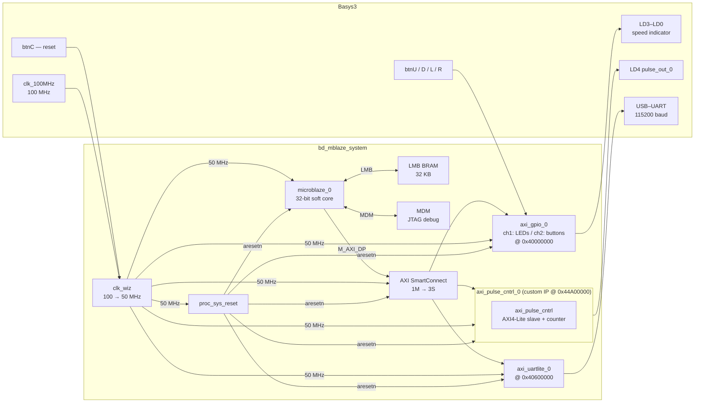
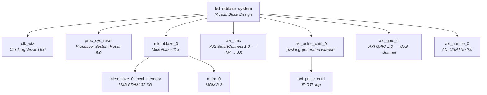
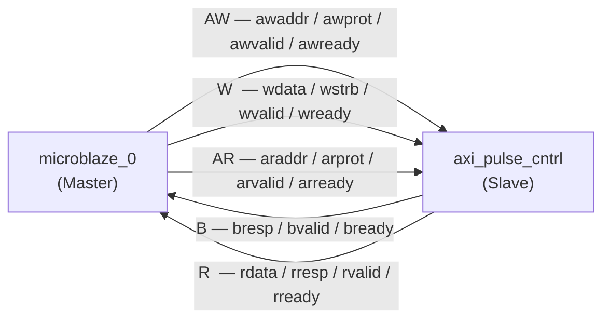
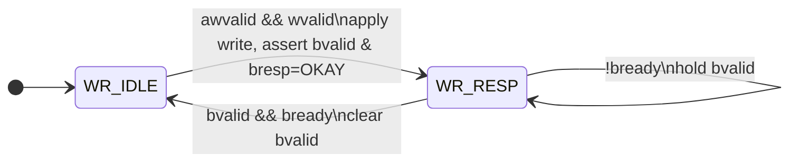
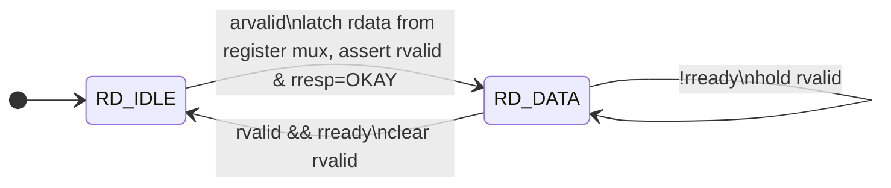
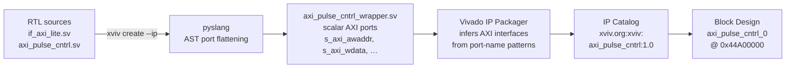
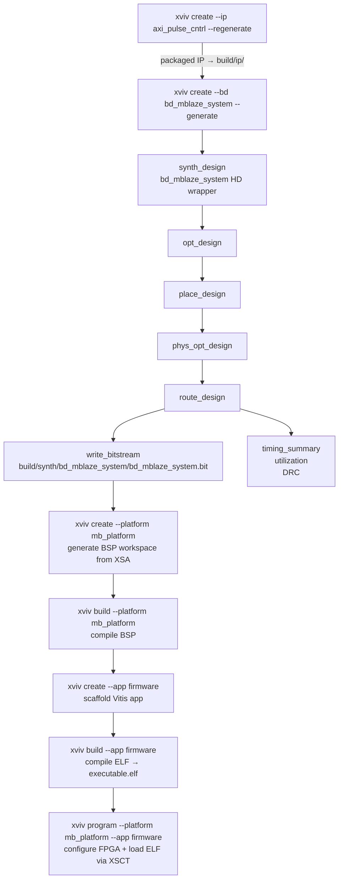

# axi-pulse-cntrl

AXI4-Lite configurable pulse-generator demo for the **Basys3** (`xc7a35tcpg236-1`).

A custom AXI4-Lite peripheral drives a free-running pulse output. A **MicroBlaze** soft-core processor controls the IP over AXI — the four on-board buttons adjust period, polarity, and enable state at runtime; LEDs mirror pulse activity and speed. All button events are logged over UART.

Built and managed with [xviv](https://github.com/laperex/xviv).

---

## System architecture



### Board I/O

| Signal | Pin | Direction | Function |
|--------|-----|-----------|---------|
| `pulse_out_0` | LD4 · W18 | Output | Generated pulse |
| `gpio_rtl_0[3:0]` | LD3–LD0 | Output | Speed indicator + pulse mirror |
| `gpio_rtl_1[3]` | btnU · T18 | Input | Halve period (faster) |
| `gpio_rtl_1[2]` | btnL · T17 | Input | Toggle output invert |
| `gpio_rtl_1[1]` | btnR · U17 | Input | Toggle enable |
| `gpio_rtl_1[0]` | btnD · U18 | Input | Double period (slower) |
| `uart_0_txd` | A18 | Output | UART TX |

---

## Project structure

```
axi-pulse-cntrl/
├── project.toml                    # xviv project config
├── constraints/
│   └── system.xdc                  # Basys3 pin assignments (LVCMOS33, false paths)
├── srcs/
│   ├── rtl/
│   │   ├── if_axi_lite.sv          # parameterised AXI4-Lite SV interface
│   │   └── axi_pulse_cntrl.sv      # custom IP — AXI4-Lite slave + pulse counter
│   ├── sim/
│   │   └── tb_axi_pulse_cntrl.sv   # IP-level testbench, 7 test groups
│   └── sw/
│       └── main.c                  # MicroBlaze bare-metal firmware
└── scripts/
    └── xviv/bd/
        └── bd_mblaze_system.tcl    # block design TCL snapshot (version-controlled)
```

`build/` is produced by xviv and is fully reproducible from the sources above.

### Block design hierarchy



---

## Register map

| Offset | Name | Access | Bits | Description |
|--------|------|--------|------|-------------|
| `0x00` | `CTRL` | R/W | `[1:0]` | Bit 0: enable. Bit 1: invert output. |
| `0x04` | `PERIOD` | R/W | `[31:0]` | Counter period in clock cycles (min 1). Default 50,000,000 → 1 Hz at 50 MHz. |
| `0x08` | `WIDTH` | R/W | `[31:0]` | High-time in clock cycles. Default 25,000,000 → 50% duty cycle. |
| `0x0C` | `STATUS` | RO | `[0]` | Current `pulse_out` value. Writes ignored. |

Writes to `PERIOD` with value `0` are clamped to `1`. The counter and `raw_pulse` reset to zero whenever `CTRL[0]` (enable) is cleared. `pulse_out = invert ? ~raw_pulse : raw_pulse`.

---

## AXI4-Lite bus

### Channel directions



### Write channel FSM

`awready` and `wready` are asserted together in `WR_IDLE`; the IP requires both AW and W to arrive simultaneously.



> Writes to `STATUS` (`0x0C`) fall through the `default` branch and are silently discarded.

### Read channel FSM



`rdata` mux: `0x00` → `reg_ctrl` · `0x04` → `reg_period` · `0x08` → `reg_width` · `0x0C` → `{31'b0, pulse_out}`.

---

## Custom IP and wrapper generation

`axi_pulse_cntrl` uses a SystemVerilog interface port (`if_axi_lite.slave s_axi`). Vivado's IP Packager cannot infer AXI bus interfaces from SV interface ports, so `[[wrapper]]` in `project.toml` instructs xviv to generate a flattened wrapper via pyslang, exposing all signals as scalar ports (`s_axi_awaddr`, `s_axi_wdata`, …). This wrapper is packaged as `xviv.org:xviv:axi_pulse_cntrl:1.0` and instantiated in the block design as `axi_pulse_cntrl_0`.



```sh
# Package the custom IP (generates wrapper, runs IP Packager)
# --regenerate re-generates output products for all cores using this IP
xviv create --ip axi_pulse_cntrl --regenerate
```

---

## Build flow



### Step-by-step

```sh
# 1. Package the custom IP
xviv create --ip axi_pulse_cntrl --regenerate

# 2. Recreate and elaborate the block design
xviv create --bd bd_mblaze_system --generate

# 3. Synthesis and implementation
xviv synth --bd bd_mblaze_system

# 4. Create Vitis BSP workspace from the XSA, then compile it
xviv create --platform mb_platform
xviv build   --platform mb_platform

# 5. Scaffold the firmware app, then compile the ELF
xviv create --app firmware
xviv build   --app firmware --info

# 6. Program the board (FPGA bitstream + ELF over JTAG)
xviv program --platform mb_platform --app firmware
```

Open a serial terminal at **115200 baud** to see firmware log output.

Outputs in `build/`:

```
synth/bd_mblaze_system/
├── bd_mblaze_system.bit
├── bd_mblaze_system.xsa
├── checkpoints/{synth,place,route}.dcp
└── reports/
    ├── synth_report_utilization_file.rpt
    ├── route_report_timing_summary_file.rpt
    └── route_report_drc_file.rpt
app/firmware/
└── executable.elf
```

### Incremental builds

```sh
# Resume from the latest available checkpoint
xviv synth --bd bd_mblaze_system --resume auto

# Constraint changed only — skip to write_bitstream
xviv synth --bd bd_mblaze_system --resume route

# RTL or BD changed — load synth.dcp, re-run from opt_design onward
xviv synth --bd bd_mblaze_system --resume synth
```

---

## Simulation

IP-level testbench (`xsim`, 7 test groups · 20 ns clock · `1ns/1ps` timescale):

| Group | Description |
|-------|-------------|
| Test 1 | `pulse_out` held low after reset (disabled by default) |
| Test 2 | `PERIOD` and `WIDTH` write / readback |
| Test 3 | Rising and falling edges appear after `CTRL_ENABLE` |
| Test 4 | `STATUS[0]` mirrors `pulse_out` on both edges |
| Test 5 | `CTRL_INVERT` flips polarity; edges still present |
| Test 6 | Clearing `CTRL_ENABLE` holds `pulse_out` low across ≥ 4 periods |
| Test 7 | Write `PERIOD = 0` clamped to 1 in register |

```sh
# Run the simulation
xviv simulate --target tb_axi_pulse_cntrl

# Open waveform in Vivado GUI
xviv open --wdb tb_axi_pulse_cntrl

# Reload an already-open waveform after re-running simulation
xviv reload --target tb_axi_pulse_cntrl
```

---

## Edit in GUI

```sh
# Block design — open in Vivado GUI / interactive Tcl
xviv edit --bd bd_mblaze_system
xviv edit --bd bd_mblaze_system --nogui

# Regenerate output products after editing
xviv generate --bd bd_mblaze_system
xviv generate --bd bd_mblaze_system --force  # force even if marked up-to-date

# IP Packager — open in Vivado GUI / interactive Tcl
xviv edit --ip axi_pulse_cntrl
xviv edit --ip axi_pulse_cntrl --nogui
```

---

## Useful commands

```sh
# Dry-run — print the Tcl xviv would send to Vivado without executing
xviv synth --bd bd_mblaze_system --dry-run

# Inspect a post-route checkpoint in Vivado
xviv open --dcp build/synth/bd_mblaze_system/checkpoints/route.dcp

# Re-program without rebuilding (bitstream already present)
xviv program --platform mb_platform --app firmware

# Reset MicroBlaze without reprogramming the FPGA
xviv processor --reset
```

---

## Prerequisites

- Python ≥ 3.11
- Vivado 2024.x with Vitis / XSCT on `PATH`, or set:
  ```sh
  export XVIV_VIVADO_SOURCE_SCRIPT=/tools/Xilinx/Vivado/2024.1/settings64.sh
  ```
- Basys3 board connected over USB-JTAG

```sh
pip install xviv
```

---
